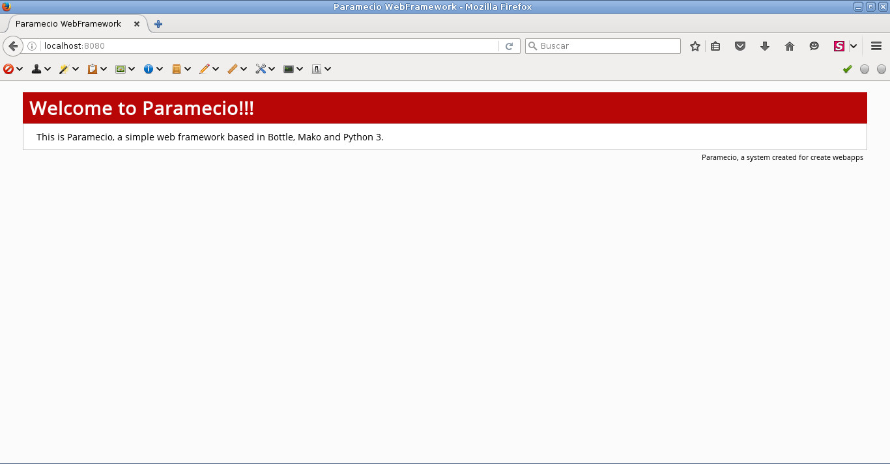
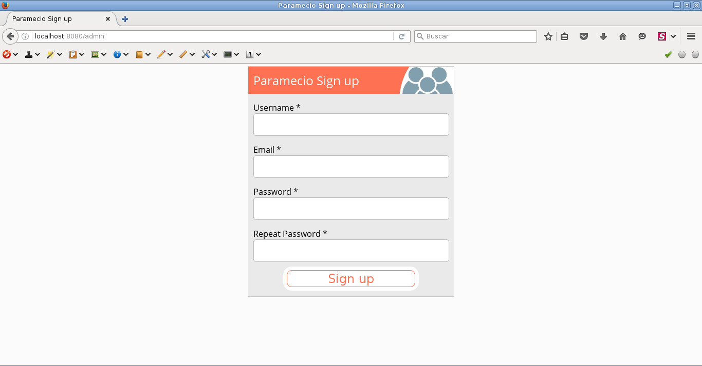
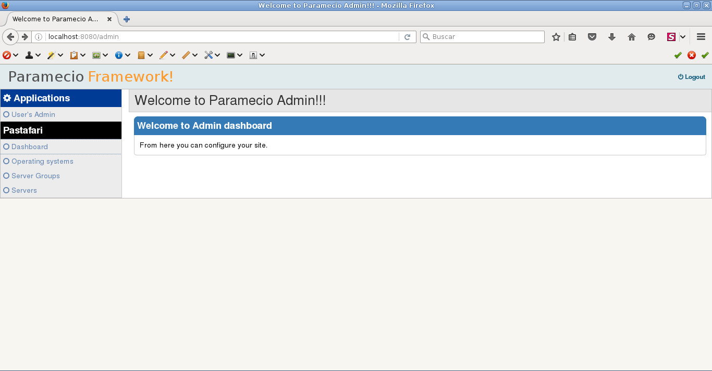

#Installation

This guide give you step by step for install pastafari sucessfully.

## Requirements

For install pastafari you need a server preferably with GNU/Linux installed. Pastafari is tested normally in Debian derivated how Ubuntu, and Red hat derivated distros how Centos or Fedora but should work fine in FreeBSD, MacOSX and other *nix like operating systems.

Also, you need the next software installed  in  your os:

### Python 3.4 or later. 

Pastafari should work fine in 3.3 but is tested in 3.4, 3.5 and 3.6 python 3 versions. 3.6 is recommended because have better performance. 

In Debian and Ubuntu you can install Python 3 using the next command: `apt-get install python3`.

In Fedora and other Red Hat derived distros you can use `yum install python3`. In RedHat/Centos 6 or 7 you need install [Ius Repos](https://ius.io/GettingStarted/) for get sane versions of python3.

In actual fedora versions you shoud use dnf command.

### MySQL or MariaDB database servers. 

MariaDB 10.0 and later are recommended.

In Debian and Ubuntu you can install MariaDB using the next command: `apt-get install mariadb-server`.

In Fedora and other Red Hat derived distros you can use `yum install mariadb-server` or `dnf install mariadb-server` if use the last fedora version. 
In RedHat/Centos 6 probably you need install adittional repositories for get latest versions of mariadb, but with MySQL 5.5, Pastafari should work fine.

When you will install the mysql server, you should create a new user database for pastafari.

### Pip

Pip is the package manager of python. You can use the package manager of your os for get python dependencies packages but in my experience is better install the packages directly with pip. 

In Debian and Ubuntu you can install pip using the next command: `apt-get install python3-pip`.

In Fedora and other Red Hat derived distros you can use `yum install python3-pip`. Of course, the command can change if you use Centos 6/7 with **Ius repos**.

### Git

[Git](https://git-scm.com/) is a tool used for manage source code repositories. Also is a tool that can be used for distribute software. For install the next tools you need git install in your server.

In Debian and Ubuntu you can install git using the next command: `apt-get install git`.

In Fedora and other Red Hat derived distros you can use `yum install git` or `dnf install git`.

### Paramiko

Paramiko is a python module for get ssh classes and methods. Is used for Pastafari for connect to the servers.

Install it with:

`pip3 install paramiko`

### Gevent

Gevent is a python module used for get async improvements in your python scripts. Pastafari use it in the task ssh part.

Install it with:

`pip3 install gevent`

### Requests

Requests is a python module used for connect via http/https to a server. Is used by webgui for connect to task server.

Install it with:

`pip3 install requests`

### Paramecio Framework

Pastafari need a web framework called Paramecio. You can install this framework using the next command in your server:

`pip3 install git+https://github.com/paramecio/parameciofm`

This command will install in your server paramecio framework with its dependencies.

When Paramecio finish the installing, a command called `paramecio` can be used for install Pastafari.

## Install Pastafari

Finally, you can install pastafari with **paramecio** command:

`paramecio --path site --modules https://bitbucket.org/paramecio/pastafari \
--domain pastafari.example.com`

* --path site : this parameter will install pastafari in **site** directory.
* --modules https://github.com/paramecio/pastafari,https://github.com/paramecio/monit : this parameter will install **pastafari** and **monit** modules in paramecio from github. Of course, Pastafari is the module used how Pastafari core. Monit module is used for monitoritation tasks of servers.
* --domain pastafari.example.com : Is the domain where pastafari webserver is located and is used for things how recovery password. Of course you need change **pastafari.example.com** for your domain.

When you execute the command, a series of questions will be showed, you need answer to all questions correctly if you want that pastafari will be installed correctly. If you get error, you need make a clean installation dropping the **site** directory and database if it was created.

## Run Pastafari

If all installation steps was performed sucessfully, you can execute Pastafari. 

Pastafari is constructed by two elements: web service and task service. The web service is used by Pastafari web gui and task server is used for perform the task in the servers via ssh. You need have the 2 daemons running for get pastafary completely functional.

### Pastafari webgui

This part is the webserver used for communicate with task server part and show all info about your servers, etc. 

Enter first  in pastafari directory:

`cd site`

Execute the next command:

`python3 index.py`

You would get this text in your terminal:

`Bottle v0.12.9 server starting up (using CherryPyServer())...
Listening on http://0.0.0.0:8080/
Hit Ctrl-C to quit.`

Now enter in your browser the next url:

`http://localhost:8080`

If you get this image:

Congratulations, Pastafari webgui is installed!!!.

### Pastafari task server

The Pastafari task server is the element used by Pastafari for communicate with servers via ssh, you can run the task server with this command:

Enter first in pastafari directory:

`cd site`

Execute the next command in other terminal:

`bottle.py -b 127.0.0.1:1337 --server gevent scheduler:app`

If this message  is showed without errors:

`Bottle v0.12.9 server starting up (using GeventServer())...
Listening on http://127.0.0.1:1337/
Hit Ctrl-C to quit.`

The task server was installed correctly!!!.

For complete deployment (booting the services in boot for example), view [this section](/deploying): 

## Finishing installation

For finish the installation you need put this url in your browser:

`http://localhost:8080/admin`

You will get this image:

You need fill the form correctly with you username, email, password...

When you finish this step,you will be redirected to login screen. Login and finally you get this screen:

**Congratulations!!! Now you have a Pastafari server working!**

You can learn now how add servers, make tasks in your servers, etc.

