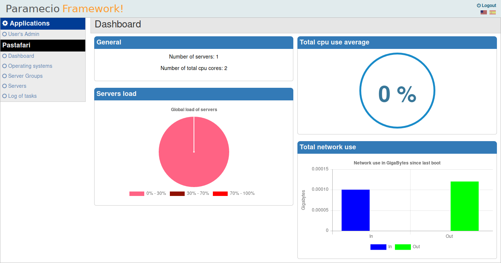

# Introduction

With this guide you will can add servers to pastafari, execute tasks in it, and update it.

Each section in this guide will talk about the options that you have in Pastafari left menu,

## Server Groups

First, you need a group where you save your servers. A group is util for organize your hosts. For example, if you have multiple individual [LAMP servers](https://en.wikipedia.org/wiki/LAMP_(software_bundle)) you can create a group called LAMP and group this servers in it. 

Create a new group is very simple,simply click in Add new Item and fill the simple form with the name of the new group.

Also, you have other option where you can choose the father of this group if you wish organize the servers hierachically.

When you have a new group, you can add a new server.

## Servers

When you enter in this section, a series of options will be showed with a listing where the added servers will be showed.

### Adding a server.

For now, for add your server in Pastafari you need root user and password. 

In next versions probably you can use other access how ssh key authentication but for now you need access to root use. The reason for it is that most providers create the server instances and give you root user and password. Of course, Pastafari give you the option for clean the root password for forbid its use for foreign agents **but is recommended have other ssh user access with root privileges**.

Well, when you click in **Add new item** in servers section you will find a new form. Fill it and click submit. Remember, you need root password.

Is important select fine the operating system of your platform, because be used how reference for execute the scripts prepared for it.

When you click  in submit, a new webpage will be showed with the progress. In five minutes should have finished. If you have any problem, please talk to us in [our support forum](http://pastafariproject.com/bbs).

When the task will be finished, you can go back to servers homepage and you see in a table the new server added with a column called "Status" with a green icon. 

### Servers list.

In the homepage of servers section you will find a list with all servers in you pastafari site. In the servers table you can see the status of servers. If status server is green, then no problem, the server is up. If status is red, the server is down, and you need see what happened. **Pastafari for now, cannot reboot servers and you need access to control panel of your server for it**.

*In next releases, you will can create directly servers using some inferface how [libcloud](https://libcloud.apache.org/)*

Also,you have an options fields where you have some options how **Graphs** where you have a graphics series with network status, cpu status, disks information, memory status...

In logs option will be showed the logs of the tasks runned in the server. For example, if you haven't any task you see the log of the task runned when you added the server to Pastafari.

About **Delete**, this option delete the server **but doesn't delete the pastafari scripts installed in deleted server**.

*In next releases, you will have more info about your servers, how host logs or loaded processes*

### Servers options

You have a series of links above list that are useful for filter the servers by different criteria. Above list you have also a selectable list where you can choose the group where you want to work.

- **Servers down**

A filter where is showed a list with servers down.

- **Servers heavily loaded**

## Dashboard.

In Dashboard, you can get a rapid view about the healthy of servers and other util statistics. You can put in your navigator the dashboard how homepage and have updated info.

